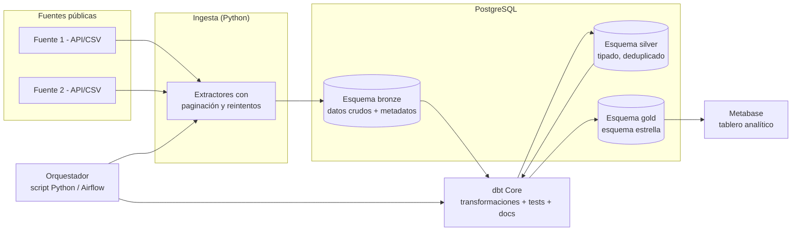

# Plan de Proyecto — Lakehouse Analítico de Datos Financieros Públicos

**Materia:** Ingeniería de Software
**Metodología:** Scrum
**Duración:** 8 semanas (4 sprints de 2 semanas)
**Equipo:** 3 integrantes
**Dedicación:** ~5 horas/semana por integrante (≈120 horas-equipo totales)

---

## 1. Contexto y problema

Los datos financieros y macroeconómicos públicos de Colombia (Superintendencia Financiera, Banco de la República, DANE, datos.gov.co) se publican en formatos, periodicidades y esquemas heterogéneos. Un analista dedica la mayor parte de su tiempo reconciliando fuentes manualmente en lugar de analizarlas, y no existe forma sencilla de rastrear de dónde salió un número que aparece en un reporte o tablero.

## 2. Objetivo del proyecto

Diseñar e implementar una plataforma de datos por capas (arquitectura *medallion*: bronze → silver → gold) que integre al menos dos fuentes públicas financieras/macroeconómicas colombianas, con pruebas automatizadas de calidad y trazabilidad (linaje) de las transformaciones, entregando un tablero analítico funcional al final del curso.

## 3. Objetivos específicos

1. Levantar los requisitos funcionales y no funcionales de la plataforma junto con el stakeholder (profesor, como Product Owner).
2. Construir extractores de datos para al menos 2 fuentes públicas.
3. Modelar los datos en tres capas (bronze/silver/gold) con transformaciones versionadas y probadas.
4. Automatizar la ejecución del pipeline de extremo a extremo.
5. Exponer los resultados en un tablero analítico que responda la pregunta de negocio definida.
6. Documentar el linaje de los datos (de qué fuente y transformación sale cada campo del tablero).

## 4. Alcance

### Dentro del alcance
- 2 fuentes de datos públicas, ya confirmadas (ver sección 6):
  1. TRM histórica — datos.gov.co (API Socrata).
  2. IPC y tasa de intervención — Banco de la República (Portal de Estadísticas Económicas).
- Arquitectura medallion implementada como 3 esquemas dentro de PostgreSQL (`bronze`, `silver`, `gold`).
- Transformaciones y pruebas de calidad con dbt Core.
- Orquestación simple (script Python o, si el tiempo lo permite, Airflow).
- Tablero en Metabase.
- Documentación de ingeniería de software completa (requisitos, HU, casos de uso, diagramas, pruebas, trazabilidad, manuales).

### Fuera del alcance (por restricción de tiempo, no por falta de valor técnico)
- Captura de cambios en tiempo real (CDC / Debezium / Kafka).
- Almacenamiento en objetos (MinIO) y formatos de tabla abiertos (Iceberg/Delta).
- Machine learning o modelos predictivos.
- Despliegue en la nube (todo corre local con Docker).

> Nota: estas exclusiones son una decisión explícita de alcance para caber en 8 semanas con 5 h/semana por persona, no una limitación técnica del equipo. Quedan documentadas como "trabajo futuro" en el informe final.

## 5. Stakeholders

| Rol | Quién | Responsabilidad |
|---|---|---|
| Product Owner | Profesor de la materia | Define y prioriza la pregunta de negocio; valida entregas |
| Representante del PO | Integrante A | Traduce necesidades del PO al equipo día a día |
| Scrum Master | Integrante C | Facilita ceremonias, remueve bloqueos |
| Equipo de desarrollo | Integrantes A, B, C | Construyen el producto |

## 6. Pregunta de negocio (validada por el PO)

El profesor, como Product Owner, validó la siguiente opción:

> **Tablero macroeconómico general** — evolución de TRM, inflación (IPC) y tasas de interés.

Las otras dos opciones consideradas (riesgo de crédito por entidad; relación tasa de intervención–inflación–costo del crédito) quedan descartadas para este alcance y documentadas como posible ampliación futura.

### Fuentes de datos definitivas

| # | Fuente | Indicador(es) | Forma de acceso |
|---|---|---|---|
| 1 | datos.gov.co | TRM histórica (diaria) | API Socrata (SODA): paginación y filtros SoQL estándar |
| 2 | Banco de la República — Portal de Estadísticas Económicas | IPC (inflación, mensual) y tasa de intervención (eventos de la Junta Directiva) | Descarga de series (no se confirmó una API REST tan directa como Socrata; hay que verificar el formato exacto de descarga en la semana 1) |

### Decisión de modelado pendiente: periodicidad mixta

TRM es diaria; IPC y tasa de intervención son mensuales o cambian solo cuando hay decisión de la Junta Directiva. Antes de construir la capa gold (sprint 3) el equipo debe decidir y documentar una de estas dos opciones:

- **Opción A — grano único diario:** un solo `fact_indicador` a grano diario, con los valores mensuales replicados hacia adelante (*forward-fill*) entre publicaciones.
- **Opción B — hechos separados por periodicidad:** una tabla de hechos para el indicador diario (TRM) y otra para los indicadores mensuales (IPC, tasa de intervención), unidas solo en el tablero.

Cualquiera de las dos es válida; lo que importa para la sustentación es justificar por escrito cuál se eligió y por qué.

---

## 7. Metodología: Scrum adaptado a 5 h/semana

- **Sprints:** 4, de 2 semanas cada uno.
- **Ceremonias:**
  - *Planning* y *Review + Retrospectiva*: una sesión de 30-45 min al inicio y al cierre de cada sprint.
  - *Daily*: asíncrona, 2-3 veces por semana (mensaje corto: qué hice / qué haré / bloqueos), no diaria presencial — el tiempo disponible no lo permite.
- **Backlog y trazabilidad:** GitHub Projects (gratuito, vive junto al código; cada historia de usuario es un *issue* enlazado a los *commits*/*PRs* que la resuelven, lo que genera la matriz de trazabilidad casi automáticamente).
- **Definition of Done (por historia de usuario):**
  - Código en la rama principal con al menos una prueba asociada (si aplica).
  - Documentación actualizada (modelo dbt documentado, o sección del documento correspondiente).
  - Revisada por al menos otro integrante.
  - Demostrable en la *review* del sprint.

## 8. Roles y reparto de trabajo

| Integrante | Desarrollo | Documentación a cargo |
|---|---|---|
| **A** | Ingesta en Python de las 2 fuentes (capa bronze) | Casos de uso, diagramas de flujo |
| **B** | Modelos dbt (silver y gold) y pruebas de calidad | Plan y casos de prueba, modelo de datos |
| **C** | Docker, orquestación, Metabase | Arquitectura, manual técnico/usuario, trazabilidad |

El levantamiento de requisitos y las historias de usuario se hacen **entre los tres** en el sprint 1, porque de ahí se desprende el resto del trabajo.

---

## 9. Arquitectura técnica

**Justificación de decisiones clave:**
- **PostgreSQL como única base de datos** (en vez de MinIO + Iceberg): simplifica el entorno sin sacrificar el concepto de capas, que se implementa como esquemas separados.
- **dbt Core** para las 3 capas: además de transformar y probar, genera documentación y un grafo de linaje automáticamente (`dbt docs generate`), lo que cubre buena parte del requisito de trazabilidad sin herramientas adicionales (se descarta OpenLineage/Marquez por tiempo).
- **Orquestación mínima primero:** un script Python que ejecuta ingesta → `dbt build` en orden. Airflow se agrega solo si el equipo va adelantado (meta opcional del sprint 3).

## 10. Stack tecnológico

| Capa | Herramienta | Estado |
|---|---|---|
| Control de versiones y backlog | Git + GitHub Projects | Confirmado |
| Contenedores | Docker + Docker Compose | Ya lo domina el equipo |
| Lenguaje de ingesta | Python | Ya lo domina el equipo |
| Almacenamiento | PostgreSQL (3 esquemas) | Confirmado |
| Transformación y calidad | dbt Core | Por aprender (curva corta si ya saben SQL) |
| Orquestación | Script Python | Confirmado / Airflow: opcional (stretch goal) |
| Visualización | Metabase | Confirmado |

**Explícitamente descartado por alcance de 8 semanas:** Kafka, Debezium (CDC), MinIO, Apache Iceberg/Delta Lake, OpenLineage/Marquez, Great Expectations.

---

## 11. Cronograma detallado

| Semana | Sprint | Documentación | Desarrollo |
|---|---|---|---|
| 1 | 1 | Definir roles, configurar GitHub Projects, identificar stakeholders, levantamiento de requisitos (funcionales y no funcionales) | Confirmar el formato exacto de descarga de series del Banco de la República (IPC, tasa de intervención) y probar la API Socrata de datos.gov.co para TRM |
| 2 | 1 | Historias de usuario con criterios de aceptación, casos de uso, backlog priorizado y validado por el PO | Docker Compose con PostgreSQL y Metabase levantados |
| 3 | 2 | Diagramas de flujo, diagrama de arquitectura/componentes, modelo de datos (ER de bronze/silver/gold) | Extractores de las 2 fuentes hacia el esquema bronze |
| 4 | 2 | Matriz de trazabilidad v1, actas de las ceremonias de los sprints 1 y 2, ensamblar documento de mitad | Pruebas de la ingesta. **→ ENTREGA DE MITAD** |
| 5 | 3 | Plan de pruebas y casos de prueba | Modelos dbt de la capa silver, con tests |
| 6 | 3 | Actualizar diagramas si el diseño cambió | Modelos dbt de la capa gold (esquema estrella) + script de orquestación. Airflow solo si hay margen |
| 7 | 4 | Ejecución y resultados de las pruebas, manual técnico y de usuario | Tablero en Metabase conectado a gold |
| 8 | 4 | Trazabilidad final, actas de sprints 3 y 4, retrospectiva general, ensamblar documento final | Integración de extremo a extremo y ensayo de la demo. **→ ENTREGA FINAL** |

**Punto crítico:** la validación de la pregunta de negocio por parte del PO debe ocurrir en la semana 1; si se retrasa, arrastra todo el sprint 1.

## 12. Entregables por hito

### Entrega de mitad (fin de semana 4)
- Documento de requisitos (funcionales y no funcionales).
- Historias de usuario con criterios de aceptación.
- Casos de uso.
- Diagramas de flujo y de arquitectura.
- Backlog priorizado (GitHub Projects).
- Actas de las ceremonias Scrum de los sprints 1-2.
- Prototipo: entorno Docker funcionando + ingesta de las 2 fuentes en bronze.

### Entrega final (fin de semana 8)
- Todo lo anterior, actualizado.
- Plan de pruebas y evidencia de ejecución.
- Manual técnico y manual de usuario.
- Matriz de trazabilidad de requisitos (requisito → historia de usuario → código → prueba).
- Actas de las ceremonias de los sprints 3-4 y retrospectiva general.
- Código completo, documentado.
- Prototipo funcional completo: pipeline bronze → silver → gold, pruebas dbt, tablero en Metabase.

---

## 13. Requisitos preliminares

> Se completan y priorizan junto con el PO en la semana 1; esta es la base de partida.

### Funcionales (borrador)
- RF-01: El sistema debe extraer TRM histórica desde datos.gov.co (API Socrata) e IPC/tasa de intervención desde el Banco de la República.
- RF-01b: El sistema debe conciliar indicadores de distinta periodicidad (TRM diaria; IPC y tasa de intervención mensuales) según la opción de modelado elegida (sección 6).
- RF-02: El sistema debe conservar los datos crudos con metadata de origen y fecha de carga (capa bronze).
- RF-03: El sistema debe limpiar, tipar y deduplicar los datos crudos (capa silver).
- RF-04: El sistema debe modelar los datos limpios en un esquema estrella orientado a la pregunta de negocio (capa gold).
- RF-05: El sistema debe ejecutar pruebas automáticas de calidad de datos (unicidad, no nulidad, integridad referencial) en cada transformación.
- RF-06: El sistema debe permitir consultar el linaje de cualquier campo de la capa gold hasta su origen.
- RF-07: El sistema debe exponer un tablero con al menos 3 visualizaciones que respondan la pregunta de negocio.
- RF-08: El sistema debe poder reejecutarse de punta a punta con un solo comando.

### No funcionales (borrador)
- RNF-01: El entorno completo debe poder levantarse con Docker Compose en cualquier máquina del equipo.
- RNF-02: El pipeline completo (ingesta + transformación) debe ejecutarse en menos de X minutos (definir umbral tras la primera medición).
- RNF-03: El código debe seguir un estándar de estilo consistente (PEP8 para Python, guía de estilo de dbt para SQL).
- RNF-04: Toda transformación debe estar versionada en Git.
- RNF-05: La documentación de los modelos dbt debe generarse automáticamente (`dbt docs`) y mantenerse actualizada.

## 14. Backlog inicial — épicas

1. **Épica 1 — Configuración del entorno:** Docker Compose, repositorio, GitHub Projects.
2. **Épica 2 — Ingesta de datos:** extractores para las 2 fuentes, manejo de errores y reintentos, carga a bronze.
3. **Épica 3 — Transformación silver:** limpieza, tipado, deduplicación, pruebas de calidad.
4. **Épica 4 — Modelado gold:** esquema estrella según la pregunta de negocio validada.
5. **Épica 5 — Orquestación:** script de ejecución de punta a punta (y Airflow, si hay margen).
6. **Épica 6 — Visualización:** tablero en Metabase.
7. **Épica 7 — Documentación y trazabilidad:** todos los artefactos de ingeniería de software exigidos por la materia.

Cada épica se descompone en historias de usuario concretas una vez el PO valida la pregunta de negocio (semana 1).

---

## 15. Riesgos y mitigaciones

| Riesgo | Probabilidad | Impacto | Mitigación |
|---|---|---|---|
| El Banco de la República no tiene una API REST tan directa como Socrata para IPC/tasa de intervención | Media | Medio | Confirmar en semana 1 el formato real de descarga (CSV/Excel programado); el extractor sigue siendo batch, solo cambia el mecanismo de acceso |
| El equipo se atrasa con dbt/Airflow por curva de aprendizaje | Media | Medio | Airflow es meta opcional (stretch goal); dbt se prioriza porque la curva es corta si ya saben SQL |
| Las 5 h/semana no alcanzan | Alta si se agrega algo fuera de alcance | Alto | Alcance fijado en 2 fuentes, sin CDC ni streaming; cualquier extra queda para "trabajo futuro" |
| La periodicidad mixta (TRM diaria vs. IPC/tasa mensual) se resuelve tarde y retrasa la capa gold | Media | Alto (bloquea sprint 3) | Decidir y documentar la opción de modelado (A o B, sección 6) desde el sprint 2 |
| Desbalance de carga entre integrantes | Baja | Medio | Roles fijos por capa (ver sección 8), cada quien defiende su parte en la sustentación |

---

## 16. Herramientas de apoyo

| Propósito | Herramienta |
|---|---|
| Control de versiones | Git + GitHub |
| Backlog y trazabilidad | GitHub Projects |
| Contenedores | Docker / Docker Compose |
| Base de datos | PostgreSQL |
| Transformación, pruebas y documentación de datos | dbt Core |
| Visualización | Metabase |
| Documentación del proyecto | Markdown (este documento y sus anexos) |

---

## 17. Próximos pasos inmediatos

1. Reunión de equipo: repasar este documento y ajustar lo que no calce con la realidad del curso.
2. Probar la API Socrata de datos.gov.co (TRM) y confirmar el formato real de descarga de series del Banco de la República (IPC, tasa de intervención).
3. Decidir la opción de modelado para la periodicidad mixta (Opción A o B, sección 6) y dejarla documentada.
4. Redactar las historias de usuario con criterios de aceptación a partir de la pregunta de negocio ya validada.
5. Crear el tablero en GitHub Projects con las épicas de la sección 14.
